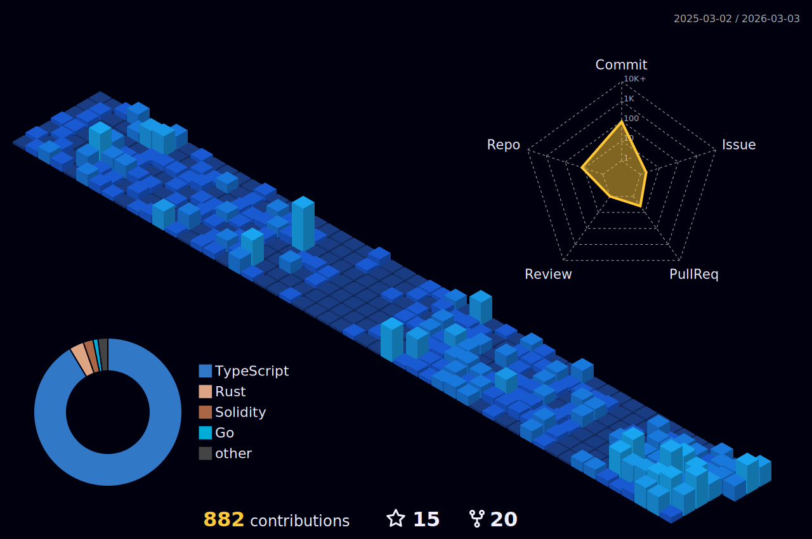

<h1 align="center"> </h1>

<h1 align="center">Hi 👋, I'm Archisman Das</h1>
<h2 align = "center"> Fullstack web3 Developer | Polygon Fellow'22 Builder Track | Dev @EPNS | EIP-1620 <h2/>
<h3>Profile Visits</h3>

|  Projects|Hackathons|Description|
|-----------|---------|---------|
|[Salaried3](https://github.com/Arch0125/salariedxyz)| Polygon Fellowship'22 Buidler Track / Backed by ETHIndia Grants / encode x Polygon Accelerator | ERC20 Payment Streams and Borrow against future salary without Collateral |
|[PayStream](https://github.com/Arch0125/PayStream)|Best DeFi project built on Polygon at ETHernals'22| Customised Payment Gateway for Crypto PoS systems |
| [DevOnChain](https://github.com/Arch0125/devonchainnext) | encode x Polygon Hackathon | Decentralized platform for organizing Hackathons - NFT Gating,SBT Certificates/ Prize Pools/ Ownership rights of Projects |
| CrossX | Winner CoinDCX Ventures Track at Warpspeed | Cross-Chain Bridge Aggregator |
| [OFFSwap](https://github.com/Arch0125/coindcxnext) | 1st Runner up CoinDCX Ventures at Warpspeed | OffChain Transaction signing for DEXes on different Chains |
| [MicroPay](https://github.com/Arch0125/MicroPay-Hackathon) | Won Eventlore'22 (MLH) and hackPrints 3.0| P2P Crypto Lending protocol - NFT as collateral |
| [CryptMyCert](https://github.com/Arch0125/CryptMyCert-Nakshatra) | Won Solo hack at Hackosphere'22 | NFT Certificates platform for Hackathons |
| [Blockchain eKYC Consortium](https://github.com/Arch0125/Blockchain-eKYC-Consortium) | Top 10 Projects at DotSlash 5.0 | Decentralised KYC platform for Banks |

- 🌱 I’m currently learning **Graph Protocol, zkSnark**

- 💬 Ask me about **Blockchain**

- ⚡ Fun fact: There is no place like concat(Coffee ☕, Rain and Window)

- 📫 How to reach me **dasarchisman25@gmail.com**

<h3 align="center"></h3>
<h3 align="center" > Connect with me: </h3>

  
  
  

<h3 align="center">Languages and Tools:</h3>

  
  
  
  
  
  
  
  
  
  
  
  
  
  
  
  
  
  

<!---->

|🎯 Most used languages 🏆| 🏆 Github Stats 🔭|
|----------------------------------|----------------------------|
| | |

|  Contribution Stats  |
|----------------------|
|  |
