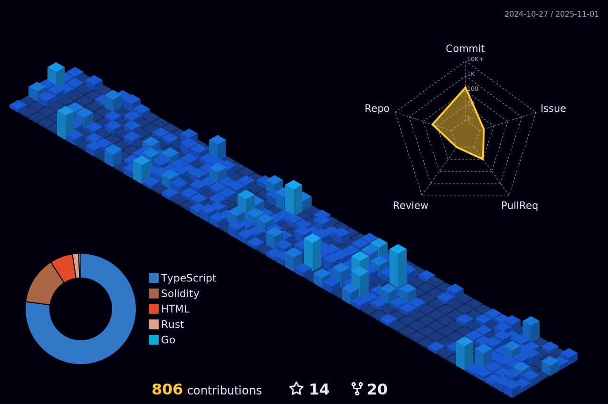

<h1 align="center"> </h1>

<h1 align="center">Hi 👋, I'm Archisman Das</h1>
<h2 align = "center"> Fullstack web3 Developer | Polygon Fellow'22 Builder Track | buildspace N&W'22 Fellow <h2/>
<h3>Profile Visits</h3>

|  Projects|Hackathons|
|-----------|---------|
|PayStream|Best DeFi project built on Polygon at ETHernals'22|
| CrossX | Winner CoinDCX Ventures Track at Warpspeed |
| OFFSwap | 1st Runner up CoinDCX Ventures at Warpspeed |
| MicroPay | Won Eventlore'22 (MLH) and hackPrints 3.0|
| CryptMyCert | Won Solo hack at Hackosphere'22 |
| Blockchain eKYC Consortium | Top 10 Projects at DotSlash 5.0 |

- 🌱 I’m currently learning **Graph Protocol, zkSnark**

- 💬 Ask me about **Blockchain**

- ⚡ Fun fact: There is no place like concat(Coffee ☕, Rain and Window)

- 📫 How to reach me **dasarchisman25@gmail.com**

<h3 align="center"></h3>
<h3 align="center" > Connect with me: </h3>

  
  
  

<h3 align="center">Languages and Tools:</h3>

  
  
  
  
  
  
  
  
  
  
  
  
  

<!---->

|🎯 Most used languages 🏆| 🏆 Github Stats 🔭|
|----------------------------------|----------------------------|
| | |

|  Contribution Stats  |
|----------------------|
|  |
